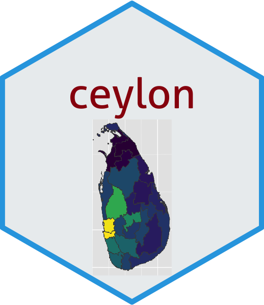

<!-- README.md is generated from README.Rmd. Please edit that file -->

```{r, include = FALSE}
knitr::opts_chunk$set(
  collapse = TRUE,
  comment = "#>",
  fig.path = "man/figures/README-",
  out.width = "100%"
)
```

# ceylon <a href='https://github.com/thiyangt/covid19srilanka'></a>

<!-- badges: start -->
<!-- badges: end -->


The goal of ceylon is to provide data to plot maps of Sri Lanka.

## Installation 

You can install the development version from [GitHub](https://github.com/) with:

``` r
# install.packages("devtools")
devtools::install_github("thiyangt/ceylon")
```
## Example

This is a basic example which shows you how to solve a common problem:

### 1. Country level

```{r example}
library(ceylon)
library(tidyverse)
library(sp)
library(viridis)
data(sf_sl_0)
ggplot(sf_sl_0) + geom_sf()
```

### 2. Provinces of Sri Lanka

```{r example0}
data(province)
province
ggplot(province) + geom_sf(mapping = aes(fill = PROVINCE), show.legend = TRUE)
```

### 3. Distribution of Population by Provinces

```{r example1}
ggplot(province) + geom_sf(mapping = aes(fill = population), show.legend = TRUE) + scale_fill_viridis(option = "inferno")
```

### 4. Distribution of Population by Districts

```{r example2}
data(district)
ggplot(district) + geom_sf(aes(fill = population), show.legend = TRUE) +  scale_fill_viridis()
```

### 5. Divisional secretariat

```{r example3}
data(sf_sl_3)
ggplot(sf_sl_3) + geom_sf()
```

### Plotting river network

```{r}
data("rivers")
ggplot(data = sf_sl_0) +
  geom_sf(fill="#edf8b1", color="#AAAAAA") +
  geom_sf(data=rivers, colour="#253494") +
  labs(title =  "Sri Lanka Rivers and Streams")
```

## Cite

Talagala, T. S. (2023). ceylon: Creating Maps of Sri Lanka Administrative Regions, Rivers and Streams. Zenodo. https://doi.org/10.5281/zenodo.10432141

### Acknowledgement

This package is inspired by the talk given by [Stephanie Kobakian](https://srk.netlify.app/) at [R-Ladies Colombo meetup](https://rladiescolombo.netlify.app/talk/3_map/).
