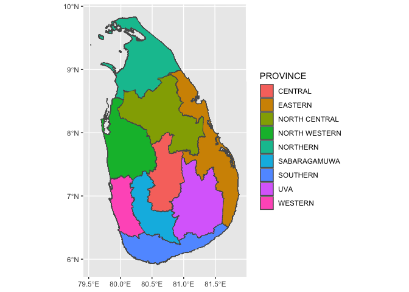

<!-- README.md is generated from README.Rmd. Please edit that file -->

# ceylondata

<!-- badges: start -->

<!-- badges: end -->

The goal of ceylondata is to provide data to plot maps of Sri Lanka.

## Installation

You can install the development version from
[GitHub](https://github.com/) with:

``` r
# install.packages("devtools")
devtools::install_github("thiyangt/ceylondata")
```

## Example

This is a basic example which shows you how to solve a common problem:

### 1\. Country level

``` r
library(ceylondata)
library(tidyverse)
#> ── Attaching packages ─────────────────────────────────────── tidyverse 1.3.0 ──
#> ✓ ggplot2 3.3.3     ✓ purrr   0.3.4
#> ✓ tibble  3.0.5     ✓ dplyr   1.0.3
#> ✓ tidyr   1.1.2     ✓ stringr 1.4.0
#> ✓ readr   1.3.1     ✓ forcats 0.5.0
#> ── Conflicts ────────────────────────────────────────── tidyverse_conflicts() ──
#> x dplyr::filter() masks stats::filter()
#> x dplyr::lag()    masks stats::lag()
library(sp)
library(viridis)
#> Loading required package: viridisLite
data(sf_sl_0)
ggplot(sf_sl_0) + geom_sf()
```


### 2\. Provinces of Sri Lanka

``` r
data(province)
province
#> Simple feature collection with 9 features and 3 fields
#> geometry type:  MULTIPOLYGON
#> dimension:      XY
#> bbox:           xmin: 362203.3 ymin: 380301.9 xmax: 621918.1 ymax: 813560.9
#> projected CRS:  SLD99 / Sri Lanka Grid 1999
#> # A tibble: 9 x 4
#>                                           geometry PROVINCE    Status population
#> *                               <MULTIPOLYGON [m]> <chr>       <chr>       <dbl>
#> 1 (((498211.2 611042.6, 498401.7 610897.1, 498415… CENTRAL     Provi…    2781000
#> 2 (((609877 559315.9, 609857.5 559313, 609845.2 5… EASTERN     Provi…    1746000
#> 3 (((501928.5 712099.6, 501970.4 712098.8, 502020… NORTH CENT… Provi…    1386000
#> 4 (((393087.5 629959, 393098.1 629956.7, 393103.2… NORTH WEST… Provi…    2563000
#> 5 (((405858.7 700083.7, 405855.3 700082, 405851.5… NORTHERN    Provi…    1152000
#> 6 (((432117.3 521875.5, 432083.5 521852.9, 432041… SABARAGAMU… Provi…    2070000
#> 7 (((481925.5 381353.7, 481922.9 381350.3, 481919… SOUTHERN    Provi…    2669000
#> 8 (((522825 568220.9, 522872.6 568217.7, 522926.1… UVA         Provi…    1387000
#> 9 (((411888.2 438189.4, 411886.4 438182.3, 411881… WESTERN     Provi…    6165000
ggplot(province) + geom_sf(mapping = aes(fill = PROVINCE), show.legend = TRUE)
```



### 3\. Distribution of Population by Provinces

``` r
ggplot(province) + geom_sf(mapping = aes(fill = population), show.legend = TRUE) + scale_fill_viridis(option = "inferno")
```


### 4\. Distribution of Population by Districts

``` r
data(district)
ggplot(district) + geom_sf(aes(fill = population), show.legend = TRUE) +  scale_fill_viridis()
```


### 5\. Divisional secretariat

``` r
data(sf_sl_3)
ggplot(sf_sl_3) + geom_sf()
```


### Acknowledgement

This package is inspired by the talk given by [Stephanie
Kobakian](https://srk.netlify.app/) at [R-Ladies Colombo
meetup](https://rladiescolombo.netlify.app/talk/3_map/).
