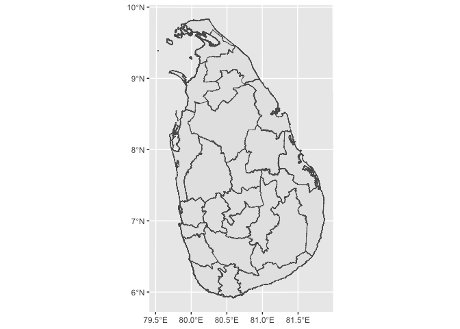

<!-- README.md is generated from README.Rmd. Please edit that file -->

# ceylon

<!-- badges: start -->

<!-- badges: end -->

The goal of ceylon is to …

## Installation

You can install the released version of ceylon from
[CRAN](https://CRAN.R-project.org) with:

``` r
install.packages("ceylon")
```

And the development version from [GitHub](https://github.com/) with:

``` r
# install.packages("devtools")
devtools::install_github("thiyangt/ceylon")
```

## Example

This is a basic example which shows you how to solve a common problem:

### 0\. Country level

``` r
library(ceylon)
library(tidyverse)
#> ── Attaching packages ─────────────────────────────────────── tidyverse 1.3.0 ──
#> ✓ ggplot2 3.3.3     ✓ purrr   0.3.4
#> ✓ tibble  3.0.5     ✓ dplyr   1.0.3
#> ✓ tidyr   1.1.2     ✓ stringr 1.4.0
#> ✓ readr   1.3.1     ✓ forcats 0.5.0
#> ── Conflicts ────────────────────────────────────────── tidyverse_conflicts() ──
#> x dplyr::filter() masks stats::filter()
#> x dplyr::lag()    masks stats::lag()
library(sp)
data(sf_sl_0)
ggplot(sf_sl_0) + geom_sf()
```


### 1\. Province level

``` r
data(sf_sl_1)
ggplot(sf_sl_1) + geom_sf()
```


### 2\. District level

``` r
data(sf_sl_2)
ggplot(sf_sl_2) + geom_sf()
```



### 3\. Divisional secretariat

``` r
data(sf_sl_3)
ggplot(sf_sl_3) + geom_sf()
```


