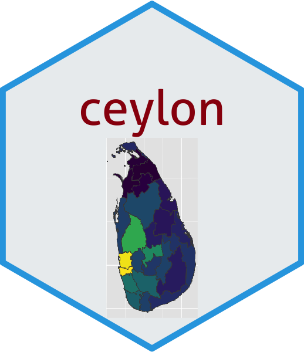
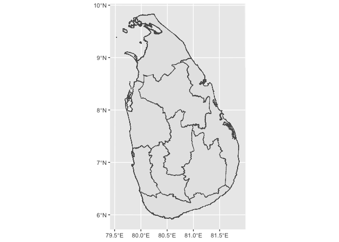
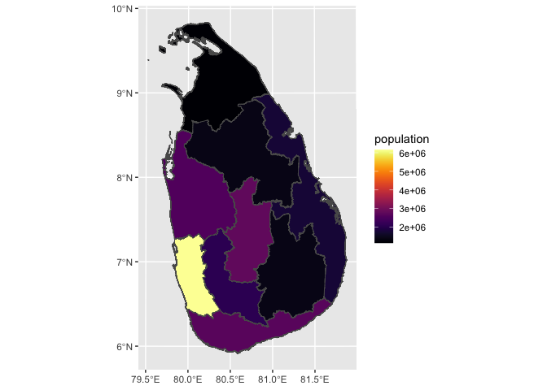
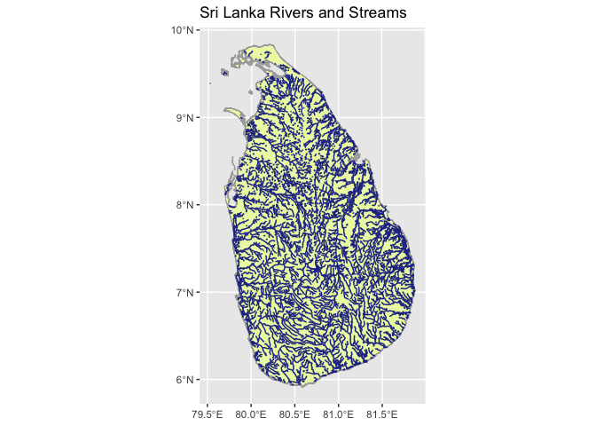

<!-- README.md is generated from README.Rmd. Please edit that file -->

# ceylon <a href='https://github.com/thiyangt/covid19srilanka'></a>

<!-- badges: start -->
<!-- badges: end -->

The goal of ceylon is to provide data to plot maps of Sri Lanka.

## Installation

You can install the development version from
[GitHub](https://github.com/) with:

``` r
# install.packages("devtools")
devtools::install_github("thiyangt/ceylon")
```

## Example

This is a basic example which shows you how to solve a common problem:

### 1. Country level

``` r
library(ceylon)
#> 
#> Attaching package: 'ceylon'
#> The following object is masked from 'package:datasets':
#> 
#>     rivers
library(tidyverse)
#> ── Attaching core tidyverse packages ──────────────────────── tidyverse 2.0.0 ──
#> ✔ dplyr     1.1.4     ✔ readr     2.1.4
#> ✔ forcats   1.0.0     ✔ stringr   1.5.1
#> ✔ ggplot2   3.4.4     ✔ tibble    3.2.1
#> ✔ lubridate 1.9.3     ✔ tidyr     1.3.0
#> ✔ purrr     1.0.2
#> ── Conflicts ────────────────────────────────────────── tidyverse_conflicts() ──
#> ✖ dplyr::filter() masks stats::filter()
#> ✖ dplyr::lag()    masks stats::lag()
#> ℹ Use the conflicted package (<http://conflicted.r-lib.org/>) to force all conflicts to become errors
library(sp)
library(viridis)
#> Loading required package: viridisLite
data(sf_sl_0)
ggplot(sf_sl_0) + geom_sf()
```


### 2. Provinces of Sri Lanka

``` r
data(province)
province
#> Simple feature collection with 9 features and 3 fields
#> Geometry type: MULTIPOLYGON
#> Dimension:     XY
#> Bounding box:  xmin: 362203.3 ymin: 380301.9 xmax: 621918.1 ymax: 813560.9
#> Projected CRS: SLD99 / Sri Lanka Grid 1999
#> # A tibble: 9 × 4
#>                                              geometry PROVINCE Status population
#> *                                  <MULTIPOLYGON [m]> <chr>    <chr>       <dbl>
#> 1 (((498211.2 611042.6, 498401.7 610897.1, 498415.9 … CENTRAL  Provi…    2781000
#> 2 (((609877 559315.9, 609857.5 559313, 609845.2 5593… EASTERN  Provi…    1746000
#> 3 (((501928.5 712099.6, 501970.4 712098.8, 502020 71… NORTH C… Provi…    1386000
#> 4 (((393087.5 629959, 393098.1 629956.7, 393103.2 62… NORTH W… Provi…    2563000
#> 5 (((405858.7 700083.7, 405855.3 700082, 405851.5 70… NORTHERN Provi…    1152000
#> 6 (((432117.3 521875.5, 432083.5 521852.9, 432041.7 … SABARAG… Provi…    2070000
#> 7 (((481925.5 381353.7, 481922.9 381350.3, 481919 38… SOUTHERN Provi…    2669000
#> 8 (((522825 568220.9, 522872.6 568217.7, 522926.1 56… UVA      Provi…    1387000
#> 9 (((411888.2 438189.4, 411886.4 438182.3, 411881.7 … WESTERN  Provi…    6165000
ggplot(province) + geom_sf(mapping = aes(fill = PROVINCE), show.legend = TRUE)
```



### 3. Distribution of Population by Provinces

``` r
ggplot(province) + geom_sf(mapping = aes(fill = population), show.legend = TRUE) + scale_fill_viridis(option = "inferno")
```



### 4. Distribution of Population by Districts

``` r
data(district)
ggplot(district) + geom_sf(aes(fill = population), show.legend = TRUE) +  scale_fill_viridis()
```


### 5. Divisional secretariat

``` r
data(sf_sl_3)
ggplot(sf_sl_3) + geom_sf()
```


### Plotting river network

``` r
data("rivers")
ggplot(data = sf_sl_0) +
  geom_sf(fill="#edf8b1", color="#AAAAAA") +
  geom_sf(data=rivers, colour="#253494") +
  labs(title =  "Sri Lanka Rivers and Streams")
```



### Acknowledgement

This package is inspired by the talk given by [Stephanie
Kobakian](https://srk.netlify.app/) at [R-Ladies Colombo
meetup](https://rladiescolombo.netlify.app/talk/3_map/).
