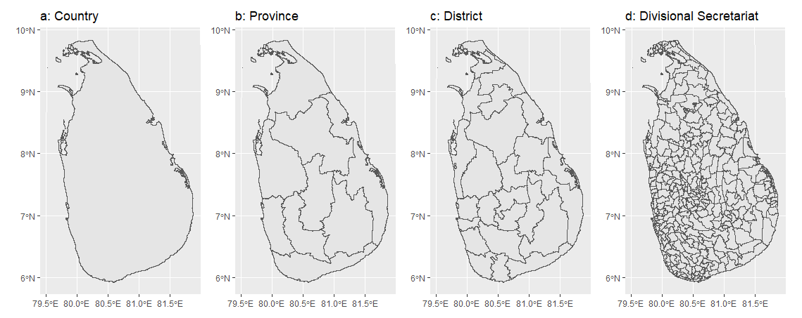
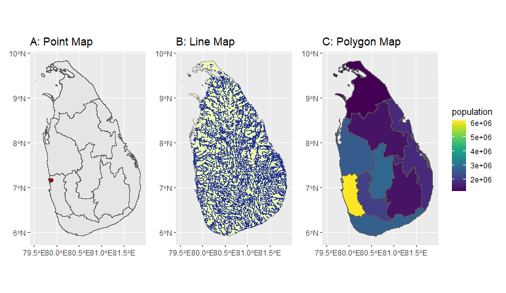

# Summary

The rapid evolution in the fields of computer science, data science and Artificial Intelligence has significantly transformed the utilization of data for decision making. Data visualisation plays a critical role in any work that involves data. Visualizing data on maps is frequently encountered in many fields. Visualizing data on maps not only transforms raw data into visually comprehensible representations but also convert complex spatial information into simple understandable form. The  ceylon R package is  designed to make  simple features data related to Sri Lanka administrative boundaries and rivers and streams accessible for a diverse range of R users. With straightforward functionalities, this package allows users to quickly plot and explore administrative boundaries and rivers and streams in Sri Lanka.


# Statement of Need


The `ceylon` R package conveniently packages shapefiles corresponding to the geographic features of Sri Lanka, enhancing user-friendliness for seamless integration and analysis. This software stands out as a catalyst for research efficiency

# Datasets available in the package

| dataset  | description  |  data source  |
|---|---|---|---|
| sf_sl_0  |   |     |
|province   |   |    |
|district   |   |    |
|sf_sl_3   |   |    |
|rivers  |   |    |

# Usage


`ceylon` is available on [GitHub](https://github.com/thiyangt/ceylon), and can be installed and loaded into the R session using:

```r
install.packages("devtools")
devtools::install_github("thiyangt/ceylon")
library(ceylon)
```


Additional packages require for plotting  are as follows:

```r
library(ggplot2)
library(sp)
library(sf)
library(viridis)
```

Shape files available in the package


```r
data(sf_sl_0)
a <- ggplot(sf_sl_0) + geom_sf() + ggtitle ("a: Country")
data(province)
b <- ggplot(province) + geom_sf() + ggtitle("b: Province")
data(district)
c <- ggplot(district) + geom_sf() + ggtitle("c: District")
data(sf_sl_3)
d <- ggplot(sf_sl_3) + geom_sf() + ggtitle("d: Divisional Secretariat")
```

```r
library(patchwork)
(a|b|c|d)
```




## Point Map: Adding a point to the map

The Global Positioning System (GPS) coordinates of Bandaranaike International Airport, Sri Lanka is Latitude: 7.1753 Longitude: 79.8835. The goal is to plot this point along with the province boundaries. The EPSG:4326 geographic CRS system gives latitude and longitude coordinates to specify a location on the surface of the earth. Hence, before plotting first longitude and latitudes should be converted into sf object to the same coordinate reference system as the province data set. In the following code `st_as_sf` specify the current coordinate reference system for longitude and latitude. The function `st_transform` convert the current CRS to target CRS. The target CRS is the CRS associated with province which is defined as `crs = st_crs(province)` inside the `st_transform` function.

```r
airport <- data.frame(lng = 79.8835, lat = 7.1753)
airport.new <- airport |>
  st_as_sf(coords = c("lng", "lat"), crs = 4326) |>
  st_transform(crs = st_crs(province))
```

```r
point <- ggplot(province) + 
  geom_sf() + geom_sf(data = airport.new, size = 2, col = "darkred") + 
  ggtitle("a: Point")
```

## Line Map: Plot rivers and streams in Sri Lanka

```r
data("rivers")
line <- ggplot(data = sf_sl_0) +
  geom_sf(fill="#edf8b1", color="#AAAAAA") +
  geom_sf(data=rivers, colour="#253494") +
  labs(title =  "b: Line")
```

## Polygon Map: Creating a choropleth map

A choropleth map shows different regions coloured according to the numerical values associated with each individual region.

```r
polygon <- ggplot(province) + 
  geom_sf(mapping = aes(fill = population)) + scale_fill_viridis() + 
  ggtitle("c: Polygon")
```

```r
(point|line|polygon)
```



\newpage

# Acknowledgements


# References
